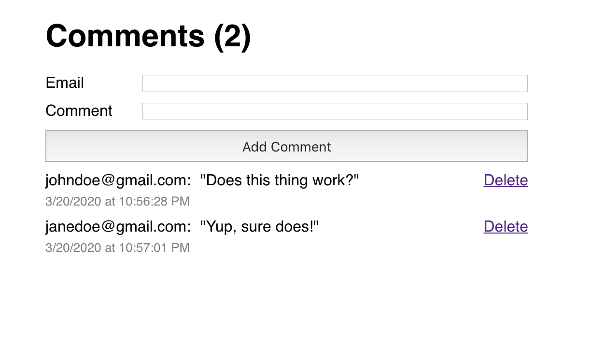

## SingleStop Frontend Developer Code Challenge

Thank you for taking the time to do our code challenge. Your task is to create a comments app using React, React 
Hooks, and Redux. Please refer to the images in the ui-screenshots directory. The layout and styling should match these 
images as closely as possible.


 
## Feature Requirements
1. The default state of the application should match the following image: `code-challenge-default-state.png`
2. Submitting a comment should display the comment below the submit button (see `code-challenge-with-one-comment.png`)
3. When one or more comments have been successfully submitted, the comment count should display in the main heading 
4. The comment count should not display when no comments have been submitted.
5. When a comment is successfully submitted, the email and comment inputs should clear (see `code-challenge-with-one-comment.png`).
6. If the email field is left empty, the comment should not submit and an error should display (see `code-challenge-error.png`)
7. Submitting a new comment does not replace the previous comment. It adds to the comments (see: ui-screenshots/code-challenge-with-two-comments.png)
8. Clicking the "Delete" button on a comment should remove it from the comments display.
9. The comments should persist if the page is reloaded. 

## What's in this project file?

We know that applying for developer jobs can be very time consuming. In the interest of saving you some time, we have 
taken the liberty of bootstrapping the project with Create React App. We have added the necessary Redux packages to the 
package.json as well. 

In order to simulate working with a backend, we have provided a mock API for comments. We also added a script to 
install the dependencies for both the frontend and the API with a single command. Additionally, we tweaked the default start
script to run the frontend on port :3000 and backend on port :5000 from a single command.

## Mock Comments API
The aforementioned mock API exposes the following endpoints on port :5000
* `GET /comments`
* `POST /comments`
* `DELETE /comments/:id`

The following sample response illustrates the shape returned by a GET request to the API:
```
{
  "1584765206902": {
    "body": "Hello world",
    "email": "kevin@coolguy.com",
    "date": "3/21/2020",
    "time": "12:33:26 AM",
    "id": "1584765206902"
  },
  "1584765240234": {
    "body": "This is a comment!",
    "email": "neil@coolguy.com",
    "date": "3/21/2020",
    "time": "12:34:00 AM",
    "id": "1584765240234"
  }
}
```

The following sample payload illustrates the correct shape of a POST request to the comment API:
```
{
  "comment": {
    "body": "This is a comment!",
    "email": "neil@coolguy.com"
  }
}
```

The sample response payload illustrates the response shape from a POST request to the API:
```
{
  "body": "This is a comment!",
  "email": "neil@coolguy.com",
  "date": "3/21/2020",
  "time": "12:34:00 AM",
  "id": "1584765240234"
}
```

### Please note the following when working with the mock API:
* The mock API stores submissions in memory but does not persist to disk. When you stop the Node.js process for the API any previously submitted comments will be gone.
* The mock API is not pre-seeded with comments. The `GET` request will not return any comments unless and until you have submitted comments. 
## Technical Requirements
1. Please use React Hooks
2. The comments should be stored in Redux, not the local state of the components.
3. Please make sure that your Redux store is exposed to Redux Dev Tools
4. Please use JavaScript Standard Style
 
This project was bootstrapped with [Create React App](https://github.com/facebook/create-react-app).

## Available Scripts

In the project directory, you can run:

### `yarn setup`

Installs the dependencies for the frontend (create react app) as well as the mock API backend

### `yarn start`

This will concurrently start the frontend on prt :3000 and the backend on port :5000.<br />

The page will reload if you make edits.<br />
You will also see any lint errors in the console.

### `yarn test`

Launches the test runner in the interactive watch mode.<br />
See the section about [running tests](https://facebook.github.io/create-react-app/docs/running-tests) for more information.

### `yarn build`

Builds the app for production to the `build` folder.<br />
It correctly bundles React in production mode and optimizes the build for the best performance.

The build is minified and the filenames include the hashes.<br />
Your app is ready to be deployed!

See the section about [deployment](https://facebook.github.io/create-react-app/docs/deployment) for more information.

### `yarn eject`

**Note: this is a one-way operation. Once you `eject`, you can’t go back!**

If you aren’t satisfied with the build tool and configuration choices, you can `eject` at any time. This command will remove the single build dependency from your project.

Instead, it will copy all the configuration files and the transitive dependencies (webpack, Babel, ESLint, etc) right into your project so you have full control over them. All of the commands except `eject` will still work, but they will point to the copied scripts so you can tweak them. At this point you’re on your own.

You don’t have to ever use `eject`. The curated feature set is suitable for small and middle deployments, and you shouldn’t feel obligated to use this feature. However we understand that this tool wouldn’t be useful if you couldn’t customize it when you are ready for it.

## Learn More

You can learn more in the [Create React App documentation](https://facebook.github.io/create-react-app/docs/getting-started).

To learn React, check out the [React documentation](https://reactjs.org/).

### Code Splitting

This section has moved here: https://facebook.github.io/create-react-app/docs/code-splitting

### Analyzing the Bundle Size

This section has moved here: https://facebook.github.io/create-react-app/docs/analyzing-the-bundle-size

### Making a Progressive Web App

This section has moved here: https://facebook.github.io/create-react-app/docs/making-a-progressive-web-app

### Advanced Configuration

This section has moved here: https://facebook.github.io/create-react-app/docs/advanced-configuration

### Deployment

This section has moved here: https://facebook.github.io/create-react-app/docs/deployment

### `yarn build` fails to minify

This section has moved here: https://facebook.github.io/create-react-app/docs/troubleshooting#npm-run-build-fails-to-minify
